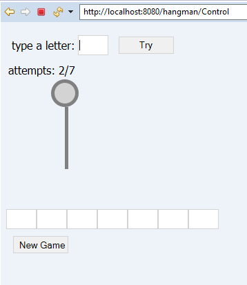

# Introduction
 A java web application that implements the Hangman.
# Technologies
  * Apache Tom Cat 9.0
  * JUnit 5
  * JavaSE 1.8
  
# General info about developing
  Program developed with Eclipse IDE for Enterprise Java Developers. Version: 2019-06 (4.12.0)
  
# How to play the game
 
* You need to guess the word, at the bottom of the page you can know how many letters the word has.
* Only 6 wrong answers allowed
* Type only one letter, after click in "Try" button.

# How to compile and run the application
* To run this project, download and install Apache Tomcat 9.0 (https://tomcat.apache.org/tomcat-9.0-doc/setup.html)
* After the Apache Tomcat Software has been correctly installed, it can copy the file hangman.war to webapps folder name. 
* `C:\Program Files\Apache Software Foundation\Tomcat 9.0\webapps\ (default installation folder on windows system)`
